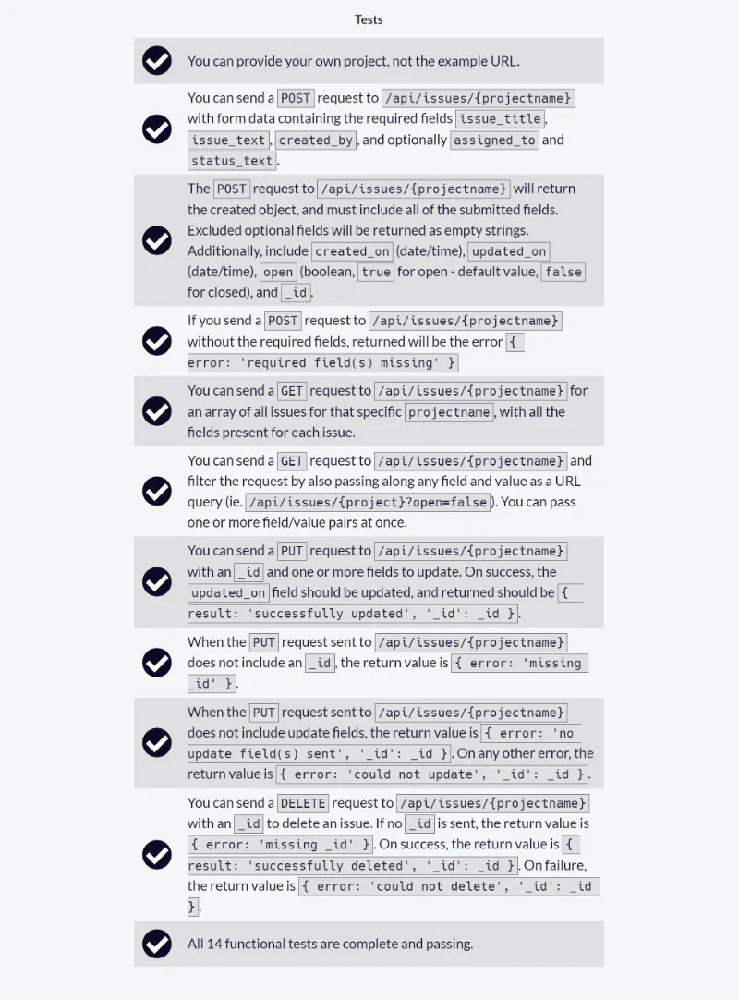
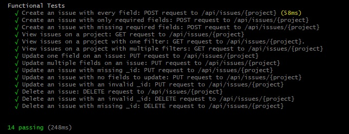
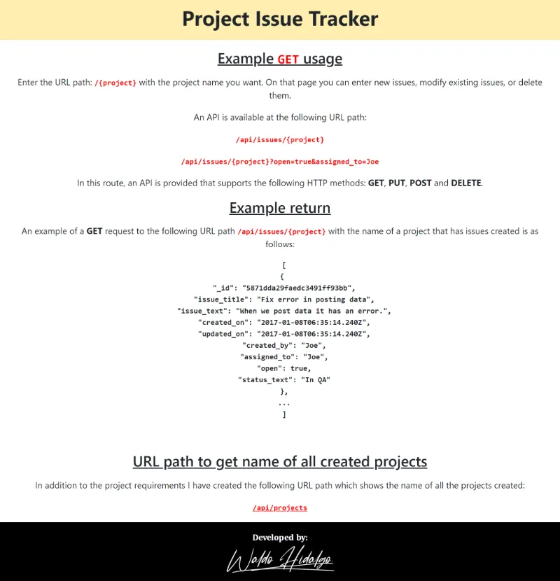
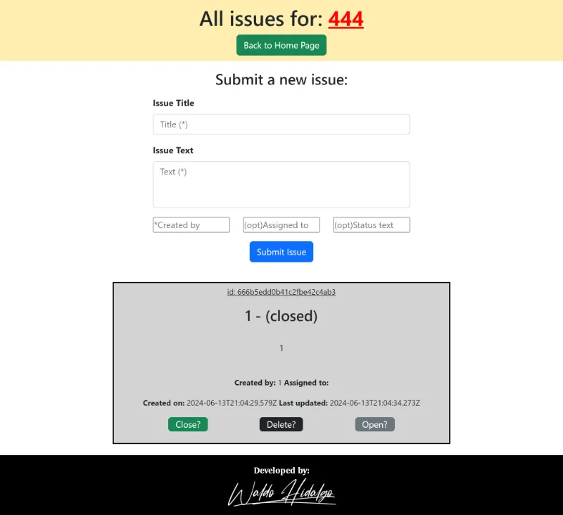

# Issue Tracker

Código solución al segundo proyecto requisito obligatorio para obtener la **Quality Assurance Certification** de freecodecamp. El proyecto consiste en crear un [Issue Tracker](https://www.freecodecamp.org/learn/quality-assurance/quality-assurance-projects/issue-tracker) de proyectos con la posibilidad de crear, leer, modificar o eliminar issues.

En el path siguiente:

> **/api/issues/{project_name}**

Si se ingresa el nombre de un proyecto creado o no creado,la ruta redirige a un formulario en el cual se puede crear nuevos issues, modificar o eliminar issues. Cuando se crea un nuevo issue para algún proyecto, en la misma página se muestra un listado de las issues creadas y sus atributos.

## Tabla de Contenidos

- [Issue Tracker](#issue-tracker)
  - [Tabla de Contenidos](#tabla-de-contenidos)
  - [Requisitos](#requisitos)
  - [Tests aprobados](#tests-aprobados)
  - [Test funcionales creados](#test-funcionales-creados)
    - [1.Create an issue with every field: POST request to /api/issues/{project}](#1create-an-issue-with-every-field-post-request-to-apiissuesproject)
    - [2. Create an issue with only required fields: POST request to /api/issues/{project}](#2-create-an-issue-with-only-required-fields-post-request-to-apiissuesproject)
    - [3.Create an issue with missing required fields: POST request to /api/issues/{project}](#3create-an-issue-with-missing-required-fields-post-request-to-apiissuesproject)
    - [4.View issues on a project: GET request to /api/issues/{project}](#4view-issues-on-a-project-get-request-to-apiissuesproject)
    - [5.View issues on a project with one filter: GET request to /api/issues/{project}.](#5view-issues-on-a-project-with-one-filter-get-request-to-apiissuesproject)
    - [6.View issues on a project with multiple filters: GET request to /api/issues/{project}](#6view-issues-on-a-project-with-multiple-filters-get-request-to-apiissuesproject)
    - [7.Update one field on an issue: PUT request to /api/issues/{project}](#7update-one-field-on-an-issue-put-request-to-apiissuesproject)
    - [8.Update multiple fields on an issue: PUT request to /api/issues/{project}](#8update-multiple-fields-on-an-issue-put-request-to-apiissuesproject)
    - [9.Update an issue with missing \_id: PUT request to /api/issues/{project}](#9update-an-issue-with-missing-_id-put-request-to-apiissuesproject)
    - [10.Update an issue with no fields to update: PUT request to /api/issues/{project}](#10update-an-issue-with-no-fields-to-update-put-request-to-apiissuesproject)
    - [11.Update an issue with an invalid \_id: PUT request to /api/issues/{project}](#11update-an-issue-with-an-invalid-_id-put-request-to-apiissuesproject)
    - [12.Delete an issue: DELETE request to /api/issues/{project}](#12delete-an-issue-delete-request-to-apiissuesproject)
    - [13.Delete an issue with an invalid \_id: DELETE request to /api/issues/{project}](#13delete-an-issue-with-an-invalid-_id-delete-request-to-apiissuesproject)
    - [14.Delete an issue with missing \_id: DELETE request to /api/issues/{project}](#14delete-an-issue-with-missing-_id-delete-request-to-apiissuesproject)
  - [Screenshots](#screenshots)
    - [1. Home Page](#1-home-page)
    - [2. Project Page](#2-project-page)

## Requisitos



## Tests aprobados



## Test funcionales creados

El proyecto requiere crear 14 tests funcionales los cuales muestro a continuación:

### 1.Create an issue with every field: POST request to /api/issues/{project}

```js
test("Create an issue with every field: POST request to /api/issues/{project}", function (done) {
  chai
    .request(server)
    .keepOpen()
    .post("/api/issues/test")
    .send({
      issue_title: "Test issue",
      issue_text: "This is a test issue",
      created_by: "Functional Test - Every field",
      assigned_to: "Jasmine",
      status_text: "In QA",
    })
    .end(function (err, res) {
      assert.equal(res.body.issue_title, "Test issue");
      assert.equal(res.body.issue_text, "This is a test issue");
      assert.equal(res.body.created_by, "Functional Test - Every field");
      assert.equal(res.body.assigned_to, "Jasmine");
      assert.equal(res.body.status_text, "In QA");
      assert.isTrue(res.body.open, "Issue should be open");
      assert.isNotNull(res.body._id);
      done();
    });
});
```

### 2. Create an issue with only required fields: POST request to /api/issues/{project}

```js
test("Create an issue with only required fields: POST request to /api/issues/{project}", function (done) {
  chai
    .request(server)
    .keepOpen()
    .post("/api/issues/test")
    .send({
      issue_title: "Test issue",
      issue_text: "This is a test issue",
      created_by: "Functional Test - Required fields",
    })
    .end(function (err, res) {
      assert.equal(res.body.issue_title, "Test issue");
      assert.equal(res.body.issue_text, "This is a test issue");
      assert.equal(res.body.created_by, "Functional Test - Required fields");
      assert.isTrue(res.body.open, "Issue should be open");
      assert.isNotNull(res.body._id);
      done();
    });
});
```

### 3.Create an issue with missing required fields: POST request to /api/issues/{project}

```js
test("Create an issue with missing required fields: POST request to /api/issues/{project}", function (done) {
  chai
    .request(server)
    .keepOpen()
    .post("/api/issues/test")
    .send({
      issue_title: "Test issue",
      issue_text: "This is a test issue",
    })
    .end(function (err, res) {
      assert.equal(res.body.error, "required field(s) missing");
      done();
    });
});
```

### 4.View issues on a project: GET request to /api/issues/{project}

```js
test("View issues on a project: GET request to /api/issues/{project}", function (done) {
  chai
    .request(server)
    .keepOpen()
    .get("/api/issues/test")
    .end(function (err, res) {
      assert.isArray(res.body);
      done();
    });
});
```

### 5.View issues on a project with one filter: GET request to /api/issues/{project}.

```js
test("View issues on a project with one filter: GET request to /api/issues/{project}.", function (done) {
  chai
    .request(server)
    .keepOpen()
    .get("/api/issues/test?open=true")
    .end(function (err, res) {
      assert.isArray(res.body);
      done();
    });
});
```

### 6.View issues on a project with multiple filters: GET request to /api/issues/{project}

```js
test("View issues on a project with multiple filters: GET request to /api/issues/{project}", function (done) {
  chai
    .request(server)
    .keepOpen()
    .get("/api/issues/test?open=false&assigned_to=Jasmine")
    .end(function (err, res) {
      assert.isArray(res.body);
      done();
    });
});
```

### 7.Update one field on an issue: PUT request to /api/issues/{project}

```js
test("Update one field on an issue: PUT request to /api/issues/{project}", function (done) {
  chai
    .request(server)
    .keepOpen()
    .post("/api/issues/test")
    .send({
      issue_title: "Título de prueba",
      issue_text: "Texto de prueba",
      created_by: "waldo",
    })
    .end(function (err, res) {
      assert.equal(res.status, 200);

      assert.isNotNull(res.body._id, "El campo _id no debe ser nulo");
      chai
        .request(server)
        .keepOpen()
        .put("/api/issues/test")
        .send({
          _id: res.body._id,
          open: false,
        })
        .end(function (err, res) {
          assert.equal(res.body.result, "successfully updated");
          done();
        });
    });
});
```

### 8.Update multiple fields on an issue: PUT request to /api/issues/{project}

```js
test("Update multiple fields on an issue: PUT request to /api/issues/{project}", function (done) {
  // crear un nuevo issue
  chai
    .request(server)
    .keepOpen()
    .post("/api/issues/test")
    .send({
      issue_title: "Título de prueba",
      issue_text: "Texto de prueba",
      created_by: "waldo",
    })
    .end(function (err, res) {
      assert.equal(res.status, 200);

      assert.isNotNull(res.body._id, "El campo _id no debe ser nulo");

      chai
        .request(server)
        .keepOpen()
        .put("/api/issues/test")
        .send({
          _id: res.body._id,
          open: false,
          assigned_to: "Jasmine",
        })
        .end(function (err, res) {
          assert.equal(res.body.result, "successfully updated");
          done();
        });
    });
});
```

### 9.Update an issue with missing \_id: PUT request to /api/issues/{project}

```js
test("Update an issue with missing _id: PUT request to /api/issues/{project}", function (done) {
  chai
    .request(server)
    .keepOpen()
    .put("/api/issues/test")
    .send({
      _id: undefined,
      open: false,
      assigned_to: "Jasmine",
    })
    .end(function (err, res) {
      assert.equal(res.body.error, "missing _id");
      done();
    });
});
```

### 10.Update an issue with no fields to update: PUT request to /api/issues/{project}

```js
test("Update an issue with no fields to update: PUT request to /api/issues/{project}", function (done) {
  chai
    .request(server)
    .keepOpen()
    .put("/api/issues/test")
    .send({
      _id: "111111111111111111111111",
    })
    .end(function (err, res) {
      assert.equal(res.body.error, "no update field(s) sent");
      done();
    });
});
```

### 11.Update an issue with an invalid \_id: PUT request to /api/issues/{project}

```js
test("Update an issue with an invalid _id: PUT request to /api/issues/{project}", function (done) {
  chai
    .request(server)
    .keepOpen()
    .put("/api/issues/test")
    .send({
      _id: "5d",
      open: false,
      assigned_to: "Jasmine",
    })
    .end(function (err, res) {
      assert.equal(res.body.error, "could not update");
      done();
    });
});
```

### 12.Delete an issue: DELETE request to /api/issues/{project}

```js
test("Delete an issue: DELETE request to /api/issues/{project}", function (done) {
  // crear un nuevo issue
  chai
    .request(server)
    .keepOpen()
    .post("/api/issues/test")
    .send({
      issue_title: "Título de prueba",
      issue_text: "Texto de prueba",
      created_by: "waldo",
    })
    .end(function (err, res) {
      assert.equal(res.status, 200);
      // verificar que res.body._id existe
      assert.isNotNull(res.body._id, "El campo _id no debe ser nulo");
      chai
        .request(server)
        .keepOpen()
        .delete("/api/issues/test")
        .send({
          _id: res.body._id,
        })
        .end(function (err, res) {
          assert.equal(res.body.result, "successfully deleted");
          done();
        });
    });
});
```

### 13.Delete an issue with an invalid \_id: DELETE request to /api/issues/{project}

```js
test("Delete an issue with an invalid _id: DELETE request to /api/issues/{project}", function (done) {
  chai
    .request(server)
    .keepOpen()
    .delete("/api/issues/test")
    .send({
      _id: "5d",
    })
    .end(function (err, res) {
      assert.equal(res.body.error, "could not delete");
      done();
    });
});
```

### 14.Delete an issue with missing \_id: DELETE request to /api/issues/{project}

```js
test("Delete an issue with missing _id: DELETE request to /api/issues/{project}", function (done) {
  chai
    .request(server)
    .keepOpen()
    .delete("/api/issues/test")
    .send({
      _id: undefined,
    })
    .end(function (err, res) {
      assert.equal(res.body.error, "missing _id");
      done();
    });
});
```

## Screenshots

### 1. Home Page



### 2. Project Page

Página para crear, editar, leer y eliminar issues del proyecto establecido en el path de la URL:


